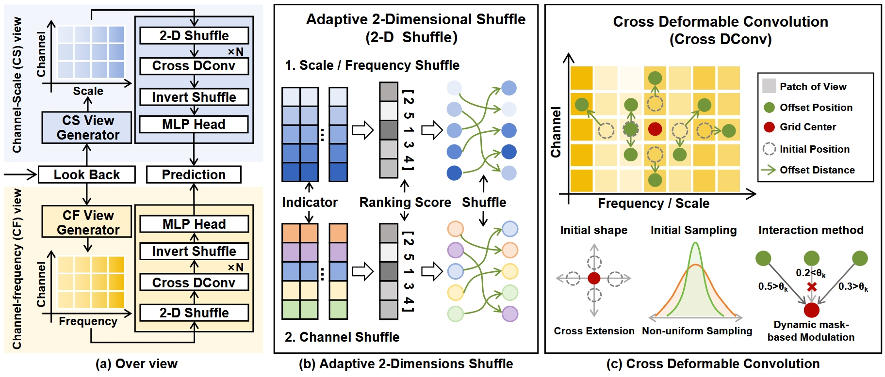

#  CCD: Capturing Cross Correlations with Deformable Convolutional Networks for Multivariate Time Series Forecasting


This code is the official PyTorch implementation of paper: CCD: Capturing Cross Correlations with Deformable Convolutional Networks for Multivariate Time Series Forecasting


## Introduction

In this study, we address these challenges by proposing a gen-
eral framework called **CCD**, which Capturing **C**ross **C**orrelations
with **D**eformable convolutional networks for multivariate time
series Forecasting. First, we design *Adaptive 2-Dimensions Shuffle*,
which adaptively reorders the rows and columns of the image-like
structures, grouping potentially dependent patches to establish lo-
cal continuity. Second, we propose *Cross Deformable Convolution*,
which is enhanced by *Non-uniform Cross-Extension initialization*
and *Dynamic mask-based modulation*. Collectively, these designs
render the module more adapted to temporal image-like structures,
empowering it to capture complex and sparse cross correlations
effectively. Extensive experiments on real-world datasets demon-
strate the state-of-the-art performance of CCD.

<div align="center">

</div>

## Quickstart

> [!IMPORTANT]
> this project is fully tested under python 3.8, it is recommended that you set the Python version to 3.8.
1. Requirements

Given a python environment (**note**: this project is fully tested under python 3.8), install the dependencies with the following command:

```shell
pip install -r requirements.txt
```

2. Data preparation

You can obtained the well pre-processed datasets from [Google Drive](https://drive.google.com/file/d/1vgpOmAygokoUt235piWKUjfwao6KwLv7/view?usp=drive_link). Then place the downloaded data under the folder `./dataset`. 

3. Train and evaluate model

- To see the model structure of **SRSNet**,  [click here](./ts_benchmark/baselines/srsnet/models/srsnet_model.py).
- We provide all the experiment scripts for SRSNet and other baselines under the folder `./scripts/multivariate_forecast`.  For example you can reproduce all the experiment results as the following script:

```shell
sh ./scripts/CCD/ETTh2.sh
```
